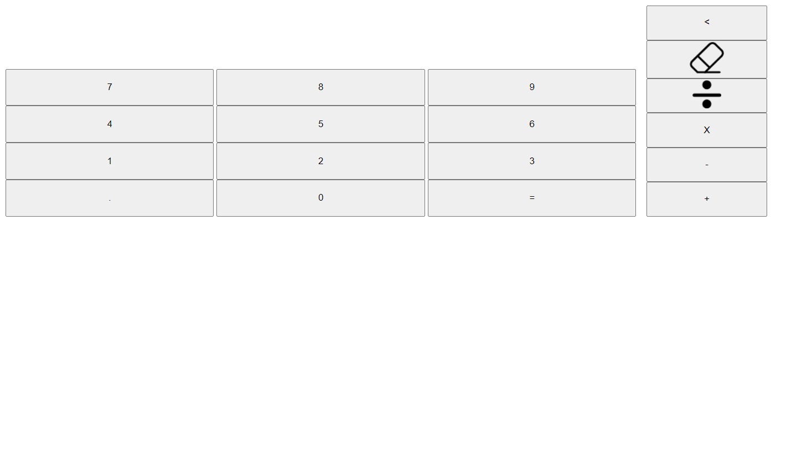

# odin-calculator
➕➖✖➗

Live Demo:
[https://ymirtuskarr01.github.io/odin-calculator/](https://ymirtuskarr01.github.io/odin-calculator/)

# problem
Make a calculator
Pressable button & enterable number
Basic math operator: add subtract multiply divide

# pseudocode
- functions:
  - operate(num1, num2): takes `num1` and `num2`
  - add, subtract, multiply, divide
  - returns sum

# requirement
- layout: basic HTML calculator with buttons for each digit, each of the above operators and an "Equals" key, clear button
- store first number, store which operation, `operate()` when user presses the *"="*, and operand key
- round answers with long decimals
- handles pressing *"="* before entering all numbers
- clear should wipe out any existing data.
- display a snarky error message if user tries to divide by 0.
- add *"."*  button. not more than 1 in one number.
- add *"backspace"* button
- add keyboard support
